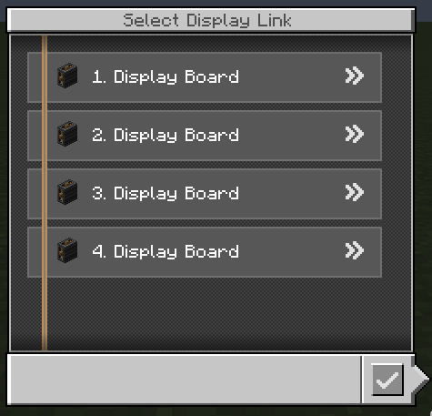
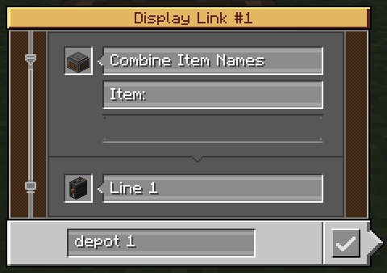

  
  <h1>Create Beamline</h1>

**Create Beamline** is an addon mod for Create that expands its display link system with multiplexing.

## What does it do?

Create Beamline introduces a new type of Display Link called the **Smart Display Link**.

It allows multiple sources and targets to be connected and managed through a single block, reducing the need for placing Display Links on every side of a block and making complex setups cleaner and easier to maintain.

    
    

